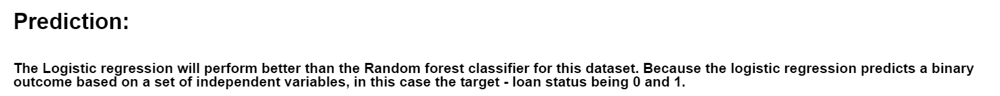
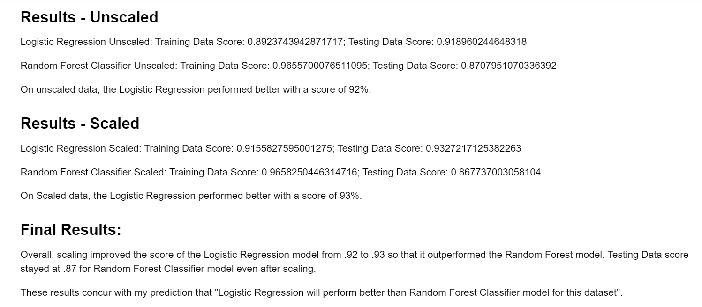

# Supervised-Machine-Learning-Predicting-Credit-Risk

A machine learning model was built to attempt to predict whether a loan would be approved or not. A comparison was made between the Logistic Regression model and Random Forest Classifier models.

### Retrieve the data

Imported the lending data `lending_data.csv` from the Resources folder using Pandas.

Preprocessed the data for `Nulls` and `duplicates`.

## Prediction

## Consider the models

Created and compared two models on this data: a `logistic regression`, and a `random forest classifier`. 

## Fit a LogisticRegression model and RandomForestClassifier model

Created a LogisticRegression model, fit it to the data and printed the `model's score`, `confusion_matrix`, and `classification_report`.
Performed the same for a RandomForestClassifier model. 

Then scaled the data and performed the model comparison on the scaled data.

Then analysed the scores across the models and here is the final results.

## Conclusion:
